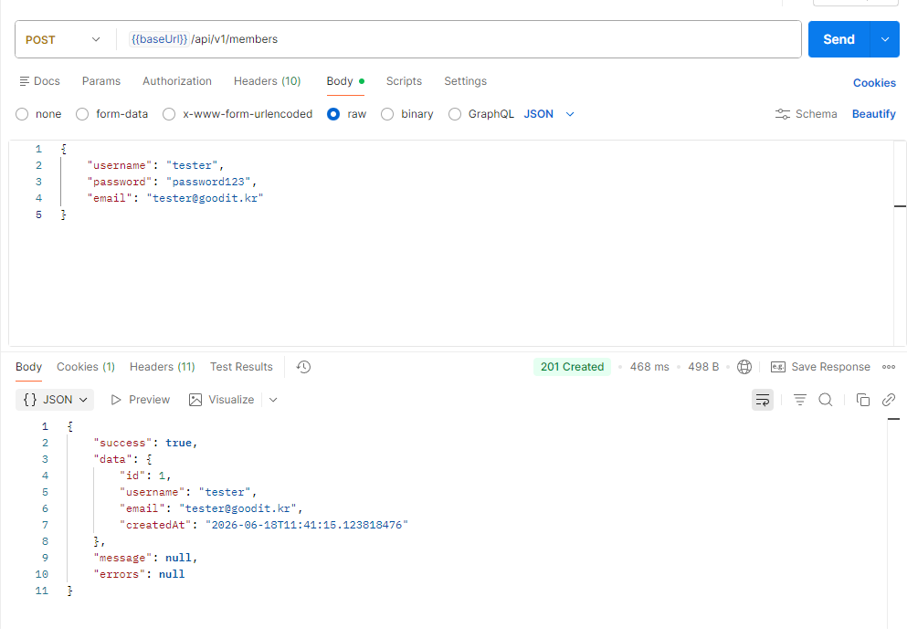
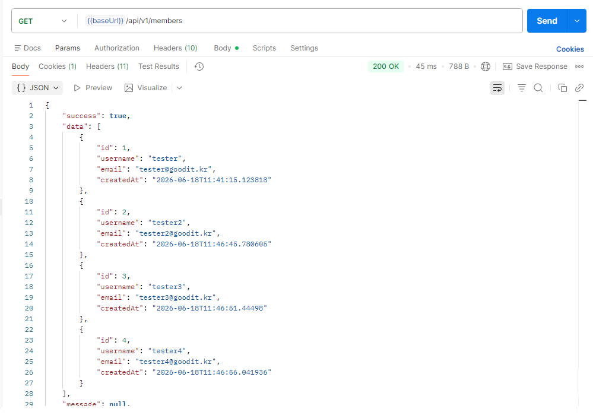
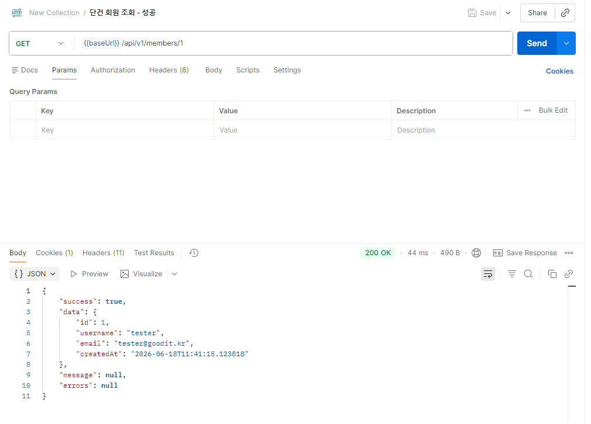
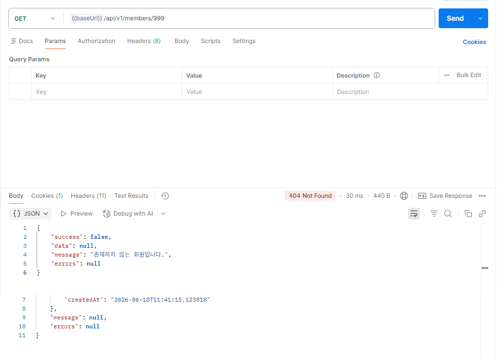
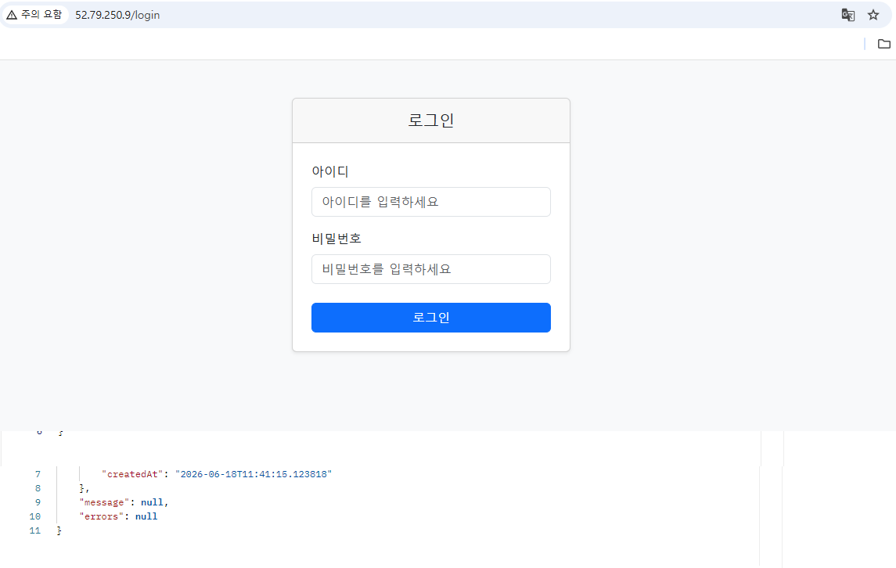
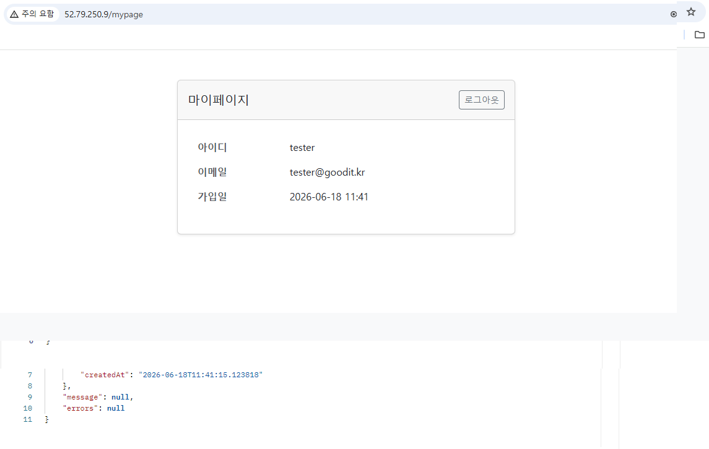
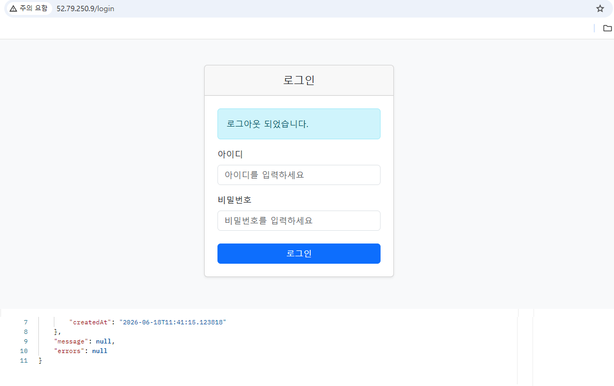
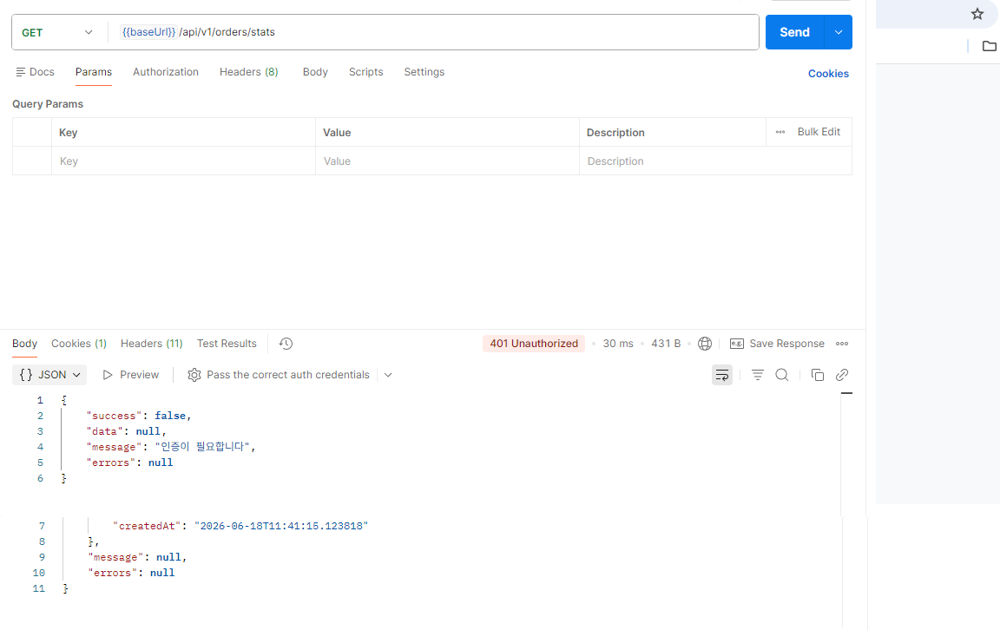
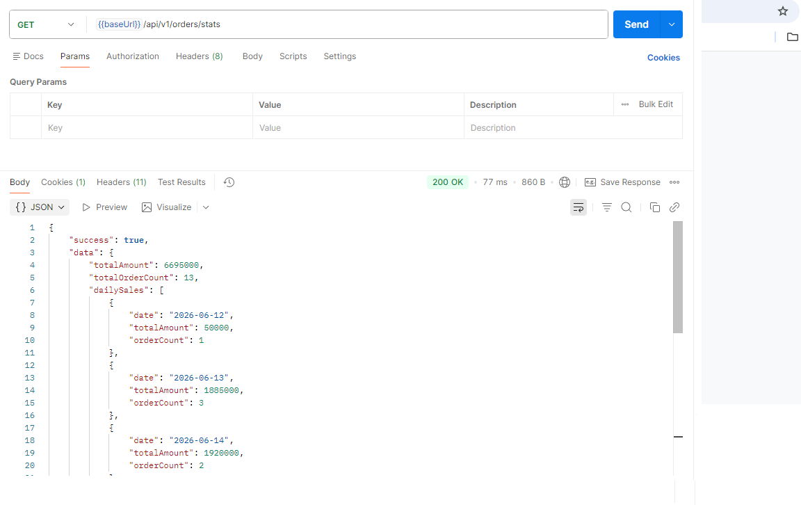

# 기능 동작 결과

## 문제 1 — 회원관리 REST API

### 1-1. 회원가입 (POST /api/v1/members)

- 정상 요청 시 201 Created와 생성된 회원 정보를 반환합니다.
- 응답은 `ApiResponse`로 래핑됩니다.

### 1-2. 전체 회원 조회 (GET /api/v1/members)

### 1-3. 단건 회원 조회 (GET /api/v1/members/{id})

### 1-4. 존재하지 않는 ID 조회 → 404

---

## 문제 3 — 로그인 및 세션

### 3-1. 로그인 화면

### 3-2. 로그인 성공 → 마이페이지

로그인 성공 시 세션에 회원 정보를 저장하고 마이페이지로 이동합니다.

### 3-3. 로그아웃

로그아웃 후 로그인 화면으로 이동합니다.

### 3-4. 미인증 API 접근 → 401

로그인 없이 API 호출 시 401 JSON을 반환합니다. 웹 페이지 요청은 `/login`으로 redirect됩니다.

---

## 문제 4 — 주문 통계 조회 API

### GET /api/v1/orders/stats

- 최근 7일(오늘 포함)의 전체 주문 합계와 일별 매출 내역을 반환합니다.
- 주문 데이터는 앱 기동 시 `DataInit`이 최근 14일치를 자동 삽입합니다.

